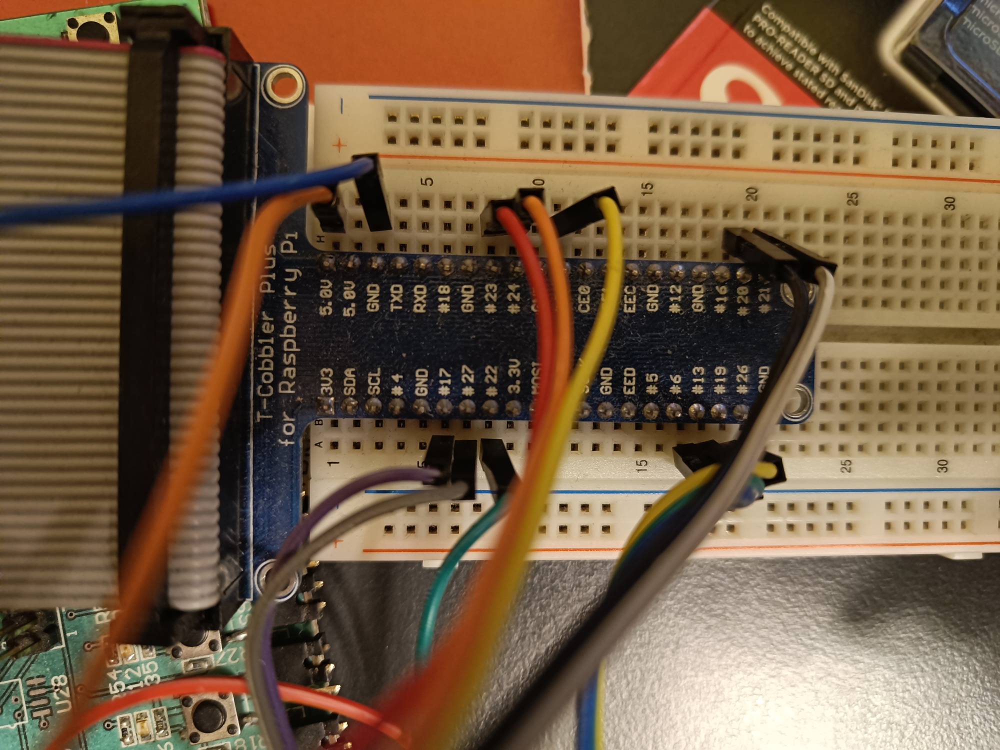
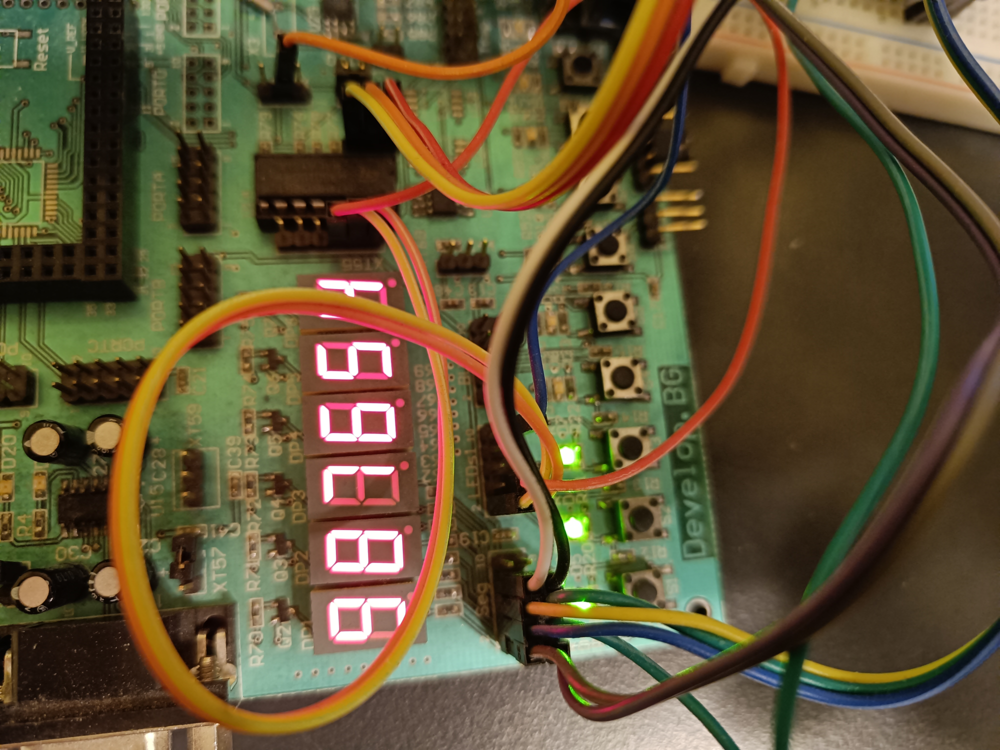
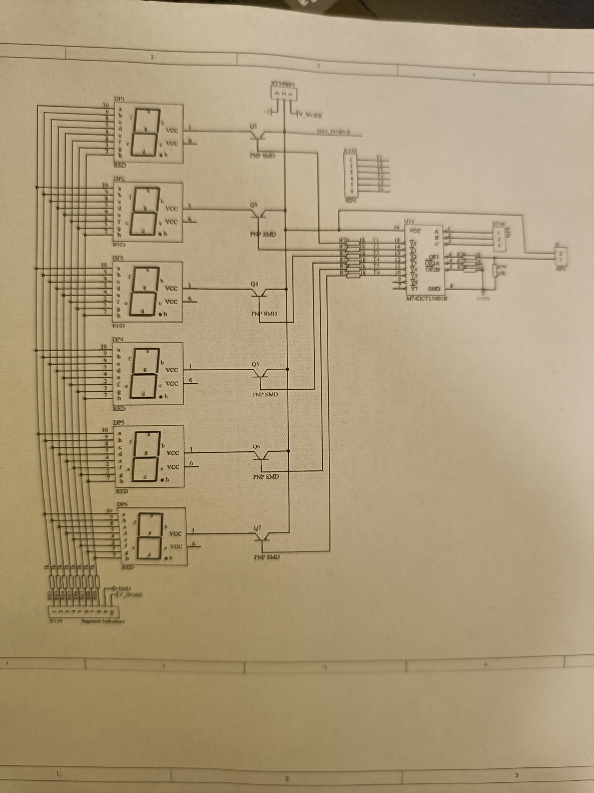

# sevseg
SEVen SEGment Linux driver (tested on Raspberry Pi 3 - Raspbian <6.1.21-v8+>)

# How-to
```
make dts
make
sudo dtoverlay sevseg.dtbo
sudo insmod sevseg.ko
```

Video:
https://www.youtube.com/watch?v=G8_zVYXSshE






